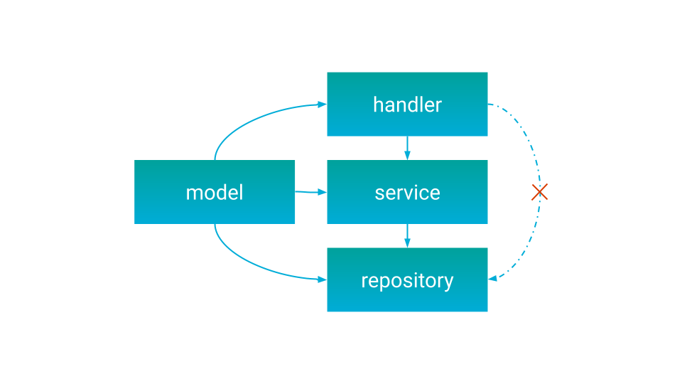

Linter used to enforce some good project structure and validate top level architecture (code layers) 

[](https://goreportcard.com/report/github.com/fe3dback/go-arch-lint)


## Quick start

### What exactly is project architecture

You can imagine some good simple architecture, for example classic onion part:



And describe/declare as semantic yaml linter config:

```yaml
version: 3
workdir: internal
components:
  handler:
    in: handlers/* # wildcard one level
  service:
    in: services/** # wildcard many levels
  repository:
    in: domain/*/repository # find all DDD repositories
  model:
    in: models

commonComponents:
  - models

deps:
  handler:
    canDependOn:
      - service
  service:
    canDependOn:
      - repository
```

And now linter will check all project code inside `internal` workdir
and show warnings, when code violate this rules.

For best experience you can add linter to you CI workflow

### Install/Run

#### Wia Docker

```bash
docker run --rm -v ${PWD}:/app fe3dback/go-arch-lint:latest-stable-release check --project-path /app
```

[other docker tags and versions](https://hub.docker.com/r/fe3dback/go-arch-lint/tags)

#### From sources
It require go 1.18+

```bash
go install github.com/fe3dback/go-arch-lint@latest
```

go will download and install `go-arch-lint` binary to go bin folder, usually
is `~/go/bin`

```bash
go-arch-lint check --project-path /home/user/go/src/github.com/fe3dback/galaxy

// or inside project directory:
cd project_dir
go-arch-lint check
```

#### Precompiled binaries

[see on releases page](https://github.com/fe3dback/go-arch-lint/releases)

### IDE plugin for autocompletion and other help


https://plugins.jetbrains.com/plugin/15423-goarchlint-file-support

## What`s new in V3 (1.7.0+)

```yaml
version: 3
allow:
  deepScan: true
```

Biggest change in V3 config (linter 1.7.0+), is deepScan option.

In v1/v2, linter check only file imports, but not analyse code itself.
deepScan is new advanced code linter, it will analyse all project AST and provide more strict
and better arch linting

--

Linter now is not require `go mod vendor` (vendor directory) for checking vendor deps.

--

Better plugin for IDEA goland. 

## Usage

```
Usage:
  go-arch-lint check [flags]

Flags:
      --arch-file string      arch file path (default ".go-arch-lint.yml")
  -h, --help                  help for check
      --max-warnings int      max number of warnings to output (default 512)
      --project-path string   absolute path to project directory (where '.go-arch-lint.yml' is located) (default "./")

Global Flags:
      --json                   (alias for --output-type=json)
      --output-color           use ANSI colors in terminal output (default true)
      --output-json-one-line   format JSON as single line payload (without line breaks), only for json output type
      --output-type string     type of command output, variants: [ascii, json] (default "default")
```

This linter will return:

| Status Code | Description                      |
|-------------|----------------------------------|
| 0           | Project has correct architecture |
| 1           | Found warnings                   |


## Archfile example

Read archfile [syntax](docs/syntax/README.md):

Example for this project [.go-arch-lint.yml](.go-arch-lint.yml)
