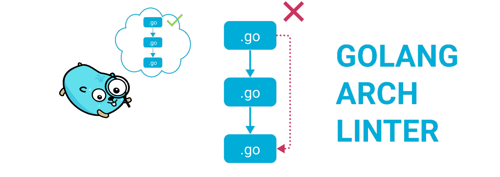
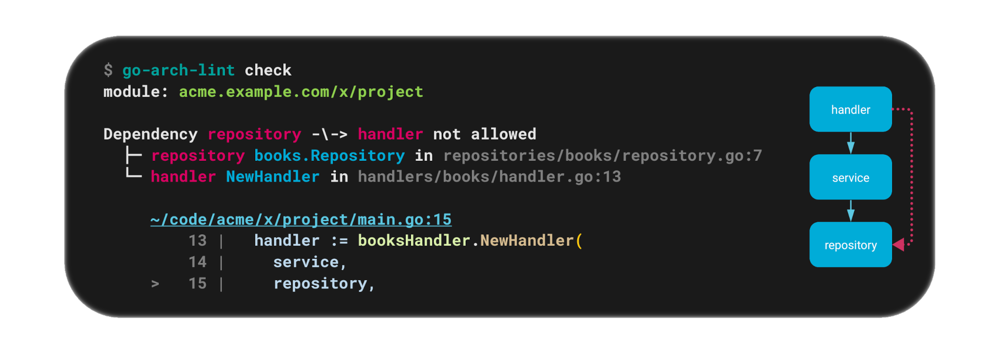
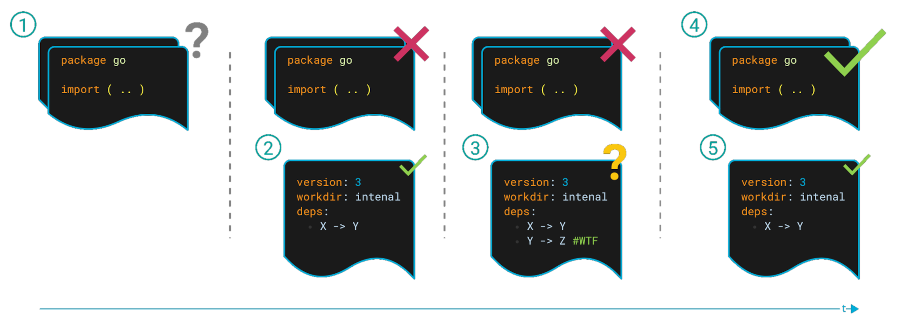
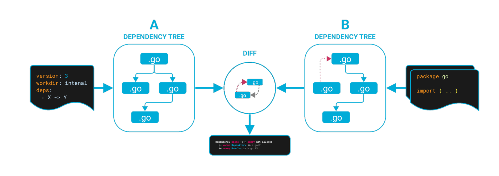
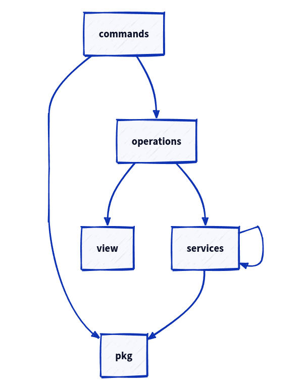

Linter used to enforce some good project structure and validate top level architecture (code layers) 

[](https://goreportcard.com/report/github.com/fe3dback/go-arch-lint)

## Quick start

### What exactly is project architecture?

You can imagine some simple architecture, for example classic onion part from "clean architecture":


And describe/declare it as semantic yaml linter config:

```yaml
version: 3
workdir: internal
components:
  handler:    { in: handlers/* }           # wildcard one level
  service:    { in: services/** }          # wildcard many levels
  repository: { in: domain/*/repository }  # wildcard DDD repositories
  model:      { in: models }               # match exactly one package

commonComponents:
  - models

deps:
  handler:
    canDependOn:
      - service
  service:
    canDependOn:
      - repository
```

see [config syntax](docs/syntax/README.md) for details. 

And now linter will check all project code inside `internal` workdir
and show warnings, when code violate this rules.

For best experience you can add linter into CI workflow

### Example of broken code

Imagine some `main.go`, when we provide `repository` into `handler` and get some bad
flow:

```go
func main() {
  // ..
  repository := booksRepository.NewRepository()
  handler := booksHandler.NewHandler(
    service,
    repository, // !!!
  )
  // ..
}
```

Linter will easily found this issue:



### Install/Run

#### Wia Docker

```bash
docker run --rm -v ${PWD}:/app fe3dback/go-arch-lint:latest-stable-release check --project-path /app
```

[other docker tags and versions](https://hub.docker.com/r/fe3dback/go-arch-lint/tags)

#### From sources
It require go 1.20+

```bash
go install github.com/fe3dback/go-arch-lint@latest
```

```bash
go-arch-lint check --project-path ~/code/my-project
# or
cd ~/code/my-project
go-arch-lint check
```

#### Precompiled binaries

[see on releases page](https://github.com/fe3dback/go-arch-lint/releases)

### IDE plugin for autocompletion and other help


https://plugins.jetbrains.com/plugin/15423-goarchlint-file-support

## Usage

### How to add linter to existing project?



Adding a linter to a project takes several steps:

1. Current state of the project
2. Create a `.go-arch-lint.yml` file describing the ideal project architecture
3. Linter find some issues in the project. Don’t fix them right now, but “legalize” them by adding them to the config and marking `todo` with the label
4. In your free time, technical debt, etc. fix the code
5. After fixes, clean up config to target state

### Execute

```
Usage:
  go-arch-lint check [flags]

Flags:
      --arch-file string      arch file path (default ".go-arch-lint.yml")
  -h, --help                  help for check
      --max-warnings int      max number of warnings to output (default 512)
      --project-path string   absolute path to project directory (where '.go-arch-lint.yml' is located) (default "./")

Global Flags:
      --json                   (alias for --output-type=json)
      --output-color           use ANSI colors in terminal output (default true)
      --output-json-one-line   format JSON as single line payload (without line breaks), only for json output type
      --output-type string     type of command output, variants: [ascii, json] (default "default")
```

This linter will return:

| Status Code | Description                      |
|-------------|----------------------------------|
| 0           | Project has correct architecture |
| 1           | Found warnings                   |


### How is working?



Linter will:
- match/mark **go packages** with **components**
- finds all dependencies between components
- build a dependency graph
- compares the actual (code) and desired (config) dependency graph
- if it got a non-empty DIFF, then project has some issues

## Graph

Example config of this repository: [.go-arch-lint.yml](.go-arch-lint.yml)



You can generate dependencies graph with command `graph`:

```bash
go-arch-lint graph
```

See full [graph documentation](docs/graph/README.md) for details.
