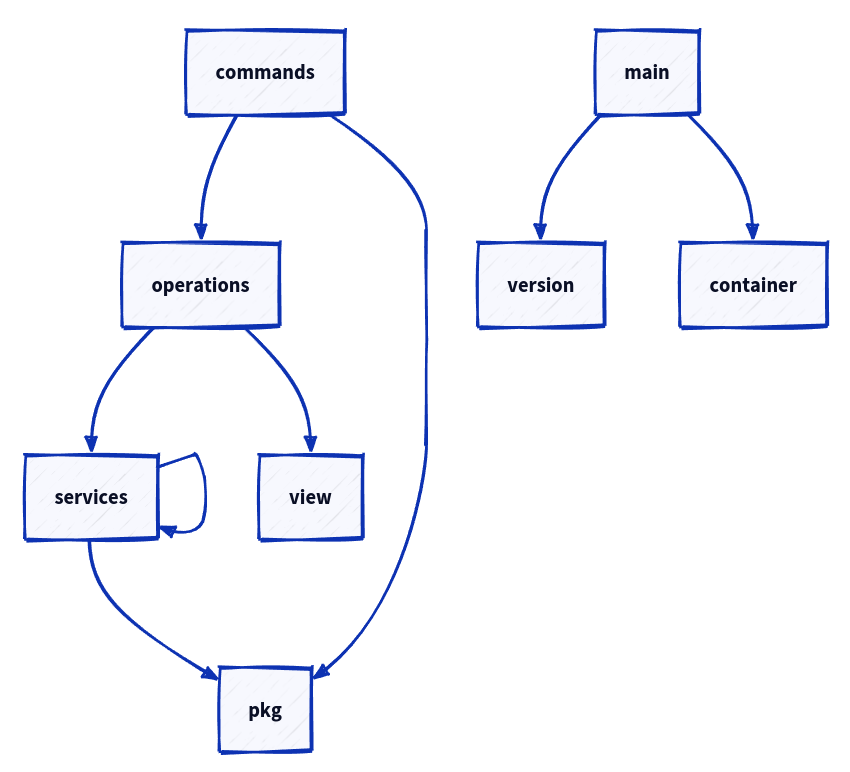
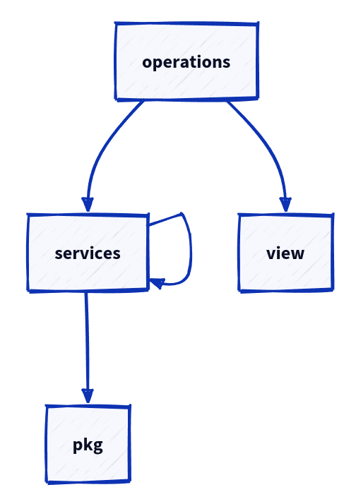
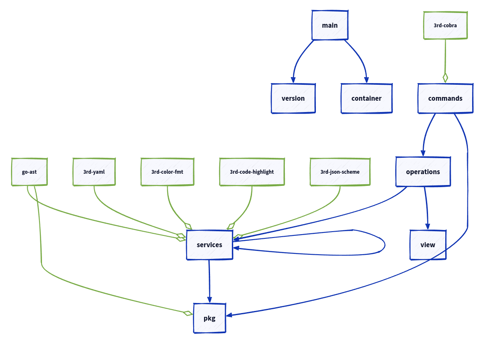

# Graph

You can generate graph's from your project deps, is useful for visual architecture overview.

```
Usage:
  go-arch-lint graph [flags]

Aliases:
  graph, g

Flags:
      --arch-file string      arch file path (default ".go-arch-lint.yml")
      --focus string          render only specified component (should match component name exactly)
  -h, --help                  help for graph
  -r, --include-vendors       include vendor dependencies (from "canUse" block)?
      --out string            svg graph output file (default "./go-arch-lint-graph.svg")
      --project-path string   absolute path to project directory (where '.go-arch-lint.yml' is located) (default "./")
  -t, --type string           render graph type [flow,di] (default "flow")

```

## Simple "FLOW" graph

```
$ go-arch-lint graph
```

Is not real "flow" of code execution, but very close to it.
This graph is actually reversed dependency injections.

For example, this is graph of `go-arch-lint`. When you execute some binary command like `graph`,
execution flow will be like in generated graph: 



### +focus

Focus allows to display only single component of graph and all recursive dependencies of it.

```
$ go-arch-lint graph --focus operations
```



### +vendor

```
$ go-arch-lint graph --include-vendors
```

This flag will add vendor libs to graph 



## DI graph type

```
$ go-arch-lint graph --type di
```

DI graph is opposite of "flow". This graph show component dependencies

